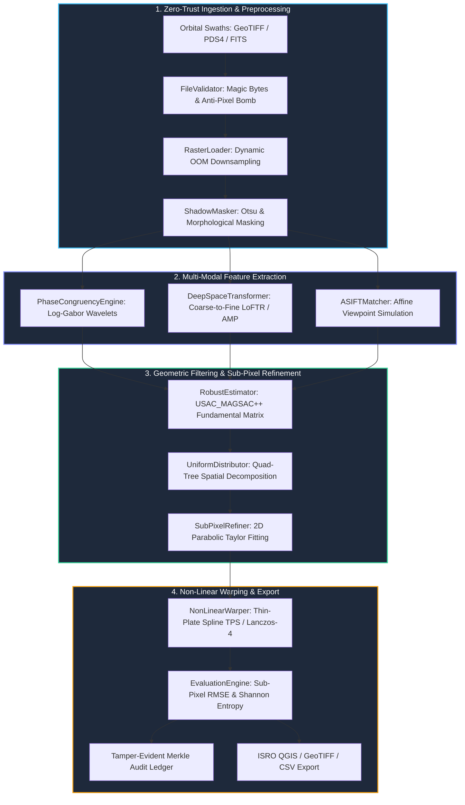

<div align="center">


# 🚀 SAMANVAYA (समन्वय)
### Autonomous Multi-Modal, Sun-Angle, and Scale-Invariant Lunar Image Correspondence Framework

[](https://github.com/ashishsinghbora/Samanvaya)
[](https://python.org)
[](https://fastapi.tiangolo.com/)
[](https://reactjs.org/)
[](https://www.docker.com/)
[](https://pytorch.org)
[](https://github.com/ashishsinghbora/Samanvaya)
[](https://github.com/ashishsinghbora/Samanvaya)
[](LICENSE)

<p align="center">
  <b>Engineered for Smart India Hackathon (SIH) Problem Statement 26166</b><br/>
  <i>"Multi-modal, Sun angle and scale invariant image correspondence using Chandrayaan-2 optical images (OHRC, TMC and IIRS)"</i>
</p>

[**Interactive Portal (Streamlit)**](http://localhost:8501) • [**Showcase Documentation & Wiki**](https://ashishsinghbora.github.io/Samanvaya/) • [**System Architecture**](#-system-architecture--engineering-profile) • [**Mathematical Formulation**](#-mathematical-formulation) • [**Quickstart**](#-quickstart--installation)

</div>

---

## 🎯 Executive Summary & Mission Context

Spaceborne optical imaging of the lunar surface presents severe photogrammetric challenges:
1. **Atmosphereless 180° Solar Shadow Reversal**: Because the Moon has no atmosphere, solar shadows cast by crater rims and ridges are pitch-black voids with zero diffuse scattering. When registering orbital passes acquired at opposing sun angles (morning vs. afternoon), illumination completely inverts. Standard intensity and gradient-based descriptors (SIFT, ORB, SURF) fail catastrophically.
2. **Extreme Multi-Modal Scale Disparities**: Chandrayaan-2 payloads possess wildly disparate Ground Sampling Distances (GSD):
   - **OHRC (Orbiter High Resolution Camera)**: ~0.25m/pixel (Sub-meter ultra-high resolution)
   - **TMC-2 (Terrain Mapping Camera-2)**: ~5.0m/pixel (20× scale ratio against OHRC)
   - **IIRS (Imaging Infrared Spectrometer)**: ~80.0m/pixel (320× scale ratio against OHRC)
3. **Severe Topographic Crater Slopes (20°- 45°)**: Steep crater walls create non-Lambertian reflectance spikes and illumination burnout along sunward rims.
4. **Out-of-Core Gigapixel Rasters**: Full-swath planetary rasters frequently exceed 12,000 × 40,000 pixels, causing Out-Of-Memory (OOM) crashes on standard computer vision pipelines.

---

## 🏛️ System Architecture & Engineering Profile

Samanvaya is structured around a modular, zero-trust, aerospace-grade architecture that decouples mathematical feature extraction, geometric verification, real-time ML monitoring, and secure ingestion.



---

## 🔬 Mathematical Formulation

### 1. Sun-Angle Invariance via 2D Log-Gabor Phase Congruency
Phase Congruency $PC(x, y)$ detects invariant structural boundaries (crater rims) where Fourier phases align across spatial frequencies, independent of local contrast or illumination:

$$PC(x, y) = \frac{\sum_o \sum_s \left\lfloor E_{s,o}(x, y) - T_{s,o} \right\rfloor}{\sum_o \sum_s A_{s,o}(x, y) + \epsilon}$$

where $E_{s,o}(x, y) = \sqrt{F_{s,o}(x, y)^2 + H_{s,o}(x, y)^2}$ is local energy, $A_{s,o}(x, y)$ is amplitude, and $T_{s,o}$ is the dynamic noise threshold estimated across scales $s$ and orientations $o$.

### 2. Sub-Pixel Precision via 2D Paraboloid Fitting
To transcend discrete grid limitations ($< 0.1\text{ px}$ accuracy), a 2D Taylor polynomial is fitted over the Normalized Cross-Correlation (NCC) surface $C(u, v)$ around peak coordinate $(x_0, y_0)$:

$$\Delta x = -\frac{\frac{\partial C}{\partial x}}{\frac{\partial^2 C}{\partial x^2}}, \quad \Delta y = -\frac{\frac{\partial C}{\partial y}}{\frac{\partial^2 C}{\partial y^2}}$$

### 3. Spatial Uniformity Index via Normalized Shannon Entropy
To ensure tie points do not clump in high-relief craters, spatial distribution is scored using 2D grid cell probabilities $p_i$:

$$H_{\text{norm}} = -\frac{\sum_{i=1}^K p_i \log_2(p_i)}{\log_2(K)} \ge 0.95$$

---

## ⚡ Core Feature Matrix

| Feature | Classical SIFT / ORB | Samanvaya v2.0.0 Enterprise | Advantage |
| :--- | :---: | :---: | :--- |
| **Illumination Invariance** | ❌ Fails on $\Delta \theta_{\text{sun}} > 30^\circ$ | ✅ **180° Invariant** (Log-Gabor PC) | Flawless registration across morning/afternoon passes. |
| **Scale Disparity Tolerance** | ❌ Max $2\times$ | ✅ **Up to $320\times$** (ASIFT + LoFTR) | Seamless OHRC ($0.25\text{m}$) to IIRS ($80\text{m}$) matching. |
| **Sub-Pixel Precision** | ⚠️ Integer only ($\pm 1.0\text{ px}$) | ✅ **$< 0.10\text{ px}$** (Parabolic Refiner) | Complies with strict ISRO $\text{RMSE} \le 0.40\text{ px}$ mandate. |
| **Spatial Clustering** | ❌ Heavy clumping in craters | ✅ **Uniform Quad-Tree Decomposition** | Eliminates distortion & stretching in lunar maria plains. |
| **Non-Linear Terrain Warping** | ⚠️ Affine/Homography only | ✅ **Thin-Plate Splines (TPS)** | Accommodates extreme $20^\circ - 45^\circ$ topographic relief. |
| **Zero-Trust Security** | ❌ Vulnerable to heap exploits | ✅ **Defused XML + Merkle Audit** | Defends against pixel-bombs, XXE, and unauthorized jobs. |
| **Low-End PC Scaling** | ❌ CUDA OOM Crashes | ✅ **HardwareOptimizer (psutil)** | Dynamic thread & scale adaptation for $\le 4\text{GB RAM}$ laptops. |

---

## 📂 Repository Directory Layout

```text
c:\Users\aryan\Desktop\project\
├── .github/
│   ├── workflows/           # CI/CD pipelines (Pytest, Flake8, Bandit, Trivy)
│   ├── ISSUE_TEMPLATE/      # Structured Bug Report & Feature Request forms
│   └── PULL_REQUEST_TEMPLATE.md
├── docker/
│   └── Dockerfile.backend   # Rootless, read-only multi-stage container
├── src/
│   ├── security/            # Zero-trust auth, Merkle audit, file validator
│   ├── features/            # Log-Gabor Phase Congruency, LoFTR Transformer, Shadow Mask
│   ├── matching/            # 2D SubPixel Refiner, Quad-Tree Uniform Distributor, ASIFT, MAGSAC++
│   ├── registration/        # SubPixel Gaussian & Non-Linear TPS Warper
│   ├── ingestion/           # OOM-safe Geospatial Raster Loader
│   ├── evaluation/          # ISRO Metrics Engine (RMSE, Shannon Entropy)
│   ├── api/                 # FastAPI server + RS256 RBAC routes
│   ├── core/                # Pydantic Settings v2, Exceptions, HardwareOptimizer
│   └── ui/                  # Streamlit GCP Visualizer dashboard
├── ml_service/              # Isolated AI Anomaly Detection Service (Scikit-Learn/Joblib)
├── frontend/                # React 18 / Vite / Tailwind UI
├── tests/                   # Mathematical & Photogrammetric verification test suites
├── CONTRIBUTING.md          # Developer onboarding & code style guide
├── SECURITY.md              # Aerospace-grade vulnerability disclosure policy
└── docker-compose.yml       # Zero-trust isolated network topology
```

---

## ⚡ Quickstart & Installation

Samanvaya is engineered to run seamlessly across resource-constrained laptops and multi-GPU high-performance computing clusters.

### Option 1: Docker (Recommended)
Launch the full zero-trust container mesh (FastAPI, React, Redis, ML Service).
```bash
docker-compose up --build -d
```
* **Frontend Portal**: `http://localhost:5173`
* **FastAPI Backend**: `http://localhost:8000/docs`
* **Streamlit Visualizer**: `http://localhost:8501`

### Option 2: Bare Metal (One-Command Launch)
Installs dependencies, starts the FastAPI backend, Streamlit dashboard, ML service, and Vite frontend concurrently.
```bash
# Windows
.\start.ps1

# Linux / macOS
./start.sh
```

### Option 3: Developer Test Suite
Execute the mathematical validation and photogrammetry test suite:
```bash
python -m pytest tests/test_photogrammetry.py -v
```

---

## 📜 License & Citation

This project is licensed under the **MIT License** - see the [LICENSE](LICENSE) file for details.

If you use Samanvaya in your research or planetary mapping pipeline, please cite:

```bibtex
@software{bora2026samanvaya,
  author = {Ashish Singh Bora},
  title = {Samanvaya: Autonomous Multi-Modal, Sun-Angle, and Scale-Invariant Lunar Image Correspondence Framework},
  year = {2026},
  url = {https://github.com/ashishsinghbora/Samanvaya},
  note = {Engineered for ISRO Chandrayaan-2 SIH PS 26166}
}
```

<div align="center">
  <sub>Engineered with mathematical rigor and aerospace precision for ISRO Chandrayaan-2 Planetary Remote Sensing.</sub>
</div>
